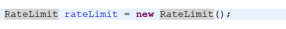
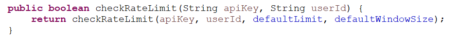
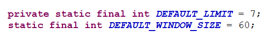
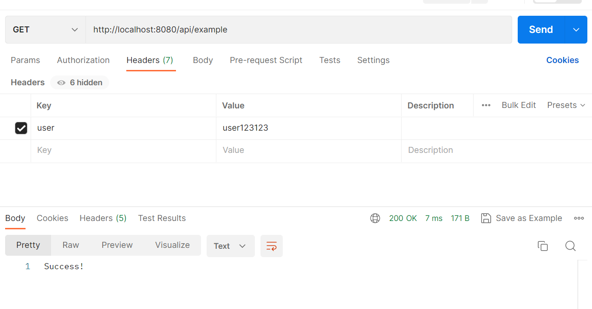
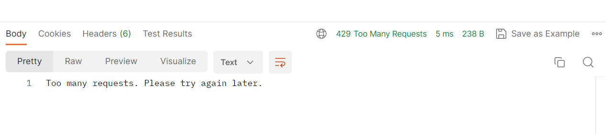

# RateLimiter

Rate Limiter is implemented for two concerns: Security and Performance.

To prevent from DDoS attack (thousands and lakhs of requests are sent to the backend server in one second, the server is unable to respond, leading to server down. So we'll use Rate Limiter there, putting a condition that in a particular time frame, that client can make a threshold request.

This is a simple implementation of a rate limiter in Java. The RateLimit class keeps track of the rate limit for a given API key and user ID. It uses a sliding window algorithm to check if the number of requests made within a specified window size exceeds the given limit.

#Usage
To use the RateLimit class, simply create an instance of the class:

 
To check if a user has exceeded the rate limit for a specific API key, call the checkRateLimit() method:

 
The default window size amd limit size is set 

   
# Implementation Details
The RateLimit class uses a Map to keep track of the rate limit for each API key and user ID. The checkRateLimit() method retrieves the rate limit for the given API key and user ID, or sets a default rate limit if none is found. It then calls the tryAcquire() method of the LimitCounter class to check if the request can be made.
  
# Logic
The LimitCounter class uses an array of timestamps to keep track of when requests were made. When a request is made, the tryAcquire() method checks if the current time minus the timestamp at the current index is greater than the window size. If it is, the timestamp at the current index is updated and the index is incremented. If the index reaches the end of the array, it wraps around to the beginning.
   
HashMap is used to store and retrieve the rate limit counters for each user and API combination.
The userApiMap variable is a Map that associates a String user ID with another Map that associates an API key with a LimitCounter object. This structure allows us to keep track of the rate limits for each user and API key combination.

    

# Execution:
Using the endpoint URL, when the request is sent by the client, if it is less than threshold limt size, it will display "sucessful" request. 
  

If it crosses the threshold, will display "Too many request, try again later" 
  

